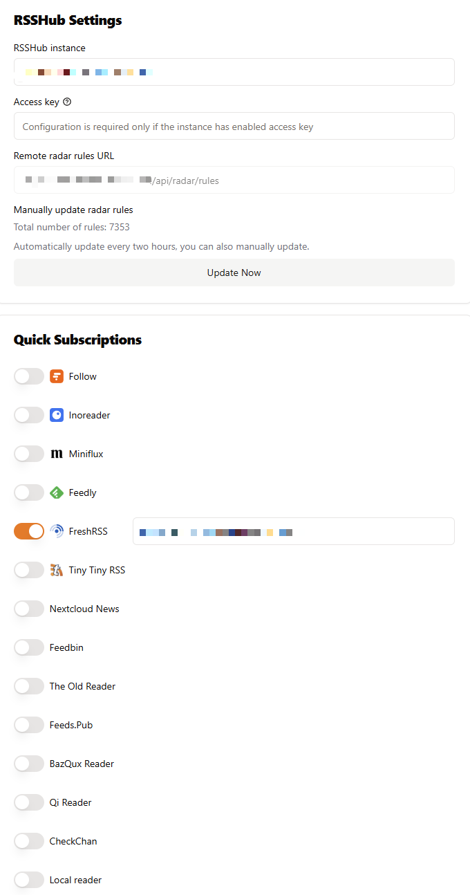
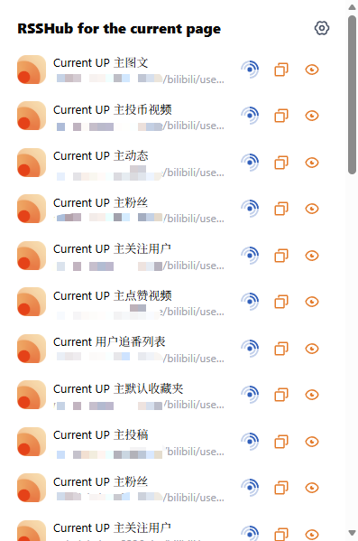

# 前言
这篇博客记录了我在**零元购条件下**花两天时间搭建出一套稳定可行的**RSS订阅云服务**的过程。

## RSS是什么？
直接借用 Wikipedia CN 的介绍:
> RSS（英文全称：RDF Site Summary 或 Really Simple Syndication），中文译作简易信息聚合，也称聚合内容，是一种消息来源格式规范，用以聚合多个网站更新的内容并自动通知网站订阅者。使用RSS后，网站订阅者无需手动查看网站是否有新的内容，同时RSS能将多个网站的更新集成并以摘要形式呈现，有助于订阅者快速获取重要信息，并选择性点击查看。

说白了就是一种**可以主动去订阅你想要的信息的方法**，可以有效地避免自己获取过多的无关内容。

## RSS适合哪些人？
* **厌倦了APP算法推荐每天喂给你的铺天盖地的大粪，想要主动去过滤信息和夺回自己注意力的人**
* 具有*一定计算机技术基础*，且愿意花时间折腾和~~使劲薅羊毛~~的人

## 为什么要自建？
许多网站都会提供RSS订阅服务(例如 Github，Twitter 等)。对于这些网站，我们可以在客户端上进行直接订阅。

但也有很多网站为了将流量锁在APP里，选择掐断了这项服务(尤其是国内的知乎等)。
对于这些没有RSS订阅服务的网站，我们只能通过 RSSHub 这样的中间件去爬取它的内容，在生成 RSS 订阅链接。

RSSHub 本身是有公共实例的，但公共实例使用人数多，带宽容易被挤占，导致响应速度不稳定。

幸运的是，RSSHub是开源的，因此我们可以通过自部署来建立自己的RSS订阅云服务。

# 方案
经过尝试，我找到了可靠的方案：
* [RSSHub](https://github.com/DIYgod/RSSHub): [Hugging Face](https://huggingface.co) Space
* FreshRSS: Hugging Face Space
* PostgreSQL: [Supabase](https://supabase.com) Free Plan
* Crontab: [Cron Job](cron-job.org)
* Reader: [Fluent Reader](https://github.com/yang991178/fluent-reader)
* Subsciption: [RSSHub Radar](https://github.com/DIYgod/RSSHub-Radar)

# RSSHub
RSSHub 本质上是一个**爬虫中间件**，用来爬取目标网页上的内容，并将其制作成 RSS 订阅链接，订阅者通过它的**路由**获取到XML形式的内容。

选择 Hugging Face Space 是出于以下原因：
* HF的免费方案为**2核16G**，在免费服务器里属于战斗机级别配置
* HF不会像 Zeabur 等厂商的免费方案一样**时断时续/排队**，连接极其稳定
* 服务器无访问次数限制

为了方便，我们使用 *官方Docker镜像* 进行部署。

在 Hugging Face 上创建 Space :


由于我们选择白嫖，SDK选择 Docker 以后直接默认使用其它配置即可创建 Space 。

在 Space 中创建如下`Dockerfile`:
```Dockerfile
# 使用chromium-bundled版本
FROM diygod/rsshub:chromium-bundled

# 设置环境变量，不指定CHROMIUM_EXECUTABLE_PATH，让Puppeteer自动检测
ENV NODE_ENV=production
ENV PORT=7860
ENV CACHE_TYPE=memory
# 移除CHROMIUM_EXECUTABLE_PATH设置，让Puppeteer自动查找

# 暴露端口
EXPOSE 7860

# 健康检查
HEALTHCHECK --interval=30s --timeout=10s --start-period=5s --retries=3 \
    CMD curl -f http://localhost:7860/healthz || exit 1

# 启动RSSHub
CMD ["npm", "start", "--", "--port", "7860"]
```
Commit 之后 Space 将自动启动容器。
届时你将在`https://<username>-<space_name>.hf.space`上看到你部署好的 RSSHub 。如果您有自己的域名，你可以尝试映射到自己的域名上。

通过`domain + route`，你就可以用 RSSHub 访问到你想要订阅的 RSS 服务。

[这里](https://docs.rsshub.app/zh/routes)可以查看目前 RSSHub 支持的所有路由。如果您具备技术基础，可以考虑给 RSSHub 提交 PR 来制作你想要的路由。

## 环境变量
### 爬虫参数
前面说到，RSSHub 可以被视作爬虫，那么必然需要让它伪装成一个普通的浏览器。在 Space 中可以通过**添加环境变量来配置这些爬虫的参数**。

例如想要获取知乎的内容可以在 Space 项目的`Variable & Secrets`中添加环境变量`ZHIHU_COOKIES`。其它网站需要的环境变量可以自行研究或通过 [DeepWiki](https://deepwiki.com) 等工具来在项目中查询。

> [!IMPORTANT]
> 为了保持 Cookie 有效，最好让 Cookie 对应的账号在相应网站中保持登录状态。

### 刷新频率
通过设置`CACHE_EXPIRE`和`CACHE_CONTENT_EXPIRE`变量，控制 RSSHub 定期抓取的频率。

### 访问限制
你还可以通过设置`ACCESS_KEY`来限制访客。

# PostgreSQL
> [!NOTE]
> 前面说到 HF Space 服务器的强悍配置。但它也有限制：**无法数据持久化**。这意味着单靠 FreshRSS ，我们无法将**缓存的数据持久化存储到硬盘里**，一旦容器重启，所有的数据都会被销毁，FreshRSS 不得不重新从 RSSHub 获取全部 Feeds。这就是为什么我们会需要一个 External 的 PostgreSQL 数据库。

~~Zeabur 可以部署 PG ，但极其不稳定，其它 Serverless 也是直接卡爆~~。我选择了连接稳定的 Supabase 。

创建过程不多赘述。创建完毕以后在导航栏点击 Connect ：


将图中的 `params` 对应到接下来 FreshRSS 的环境变量当中即可。

> [!IMPORTANT]
> Direct Connection 模式仅支持`ipv6`。如果想要兼容`ipv4`，请使用 Session Pool 模式。

# FreshRSS
同样在 Space 中创建`Dockerfile`:
```Dockerfile
FROM freshrss/freshrss:latest  
ENV LISTEN=7860  
```

## 环境变量
### 自动初始化账户和连接数据库
`FRESHRSS_INSTALL`:
```bash
# FRESHRSS_INSTALL
--default-user=<default_user_in_freshrss>
--base-url=<the_public_domain_of_hf_space>
--language=<choose_your_favorite>
--db-type=<type_in_db>
--db-host=<host_in_db> 
--db-user=<user_in_db> 
--db-password=<supabase_pwd> 
--db-base=<base_in_db> 

# Crucial: Enable Google Reader API
--api-enabled 

# CAUTION!
# This param specifies the authorization method.
# Setting it to none means that FreshRSS allows anonymous access, which can incur a safety problem.
--auth-type=form  

# CAUTION!
# This param specifies the prefix of the tables' name.
# If you start the server twice, and you use different prefixes, FreshRSS will not be able to find the tables created at the first time.
# So keep it consistent.
# By the way, If you want to specify a prefix, use --db-prefix=<prefix>
# If not, use --db-prefix, without the trailing "=".
--db-prefix
```

`FRESHRSS_USER`:
```bash
# FRESHRSS_USER
## default user
--user=<arbitrary> 
--password=<arbitrary> 

## api password
--api-password=<arbitrary>
--email=<your_email>
--language=<choose_your_favorite>
```

### 其它必要配置
`CRON_MIN`:
```bash
# Auto refresh interval
## Access RSSHub every 15 minutes in an hour
0,15,30,45
## or use standard cron job notation
*/15 * * * * 
```

`TZ`:
```bash
# Timezone, optional but recommended
TZ=Asia/Shanghai
```

`TRUSTED_PROXY`:
```bash
# The proxy you trusted. For example, cloudflare
10.0.0.0/8
```

> [!WARNING]
> 注意到，`FRESHRSS_USER`中有一个用户密码和一个**API密码**，它们分别用于登录 FreshRSS 和访问 FreshRSS 的 API 。
我们将使用 API 的密码在 Reader 进行订阅。
**并且需要注意的是，FreshRSS 的 API 接口并不在`/`下，而是位于`/api/greader.php`下**。

# Cron Job
Hugging Face 和 Supabase 都会在无请求一段时间之后休眠，因此我们需要使用 Cron Job 定时触发服务器。

在 cron-job.org 上，只需要为 FreshRSS 添加 Cron Job ，因为FreshRSS 会去请求(触发) RSSHub 和 Supabase。建议设置为*与 FreshRSS 定时更新的频率一致*。

# RSS Reader
## Selection
本人筛选出了几款能用的 RSS Reader :

| RSS Reader          | 功能                                                     | 刷新频率                       | APP内阅读体验               | UI               | 获取       |
| ------------------- | ------------------------------------------------------ | -------------------------- | ---------------------- | ---------------- | -------- |
| `Fluent Reader`(最优) | 简洁但十分强大；移动端`Fluen Reader Lite`功能较少，仅支持 Server 订阅，无直接订阅 | 高，并且能设置刷新频率                | 好                      | 一般，but who cares | 开源且免费    |
| `FeedFlow`          | 少                                                      | 可实时刷新，但只能设置进入 APP 时刷新和手动刷新 | 网页阅读体验差，且知乎等部分网站抓取不到全文 | 简洁               | 免费       |
| `Folo`              | 丰富，有AI集成(~~虽然没格调用~~)                                   | 低，并且频率非常迷惑                 | 好                      | 好                | Pro 需要收费 |

## 订阅 FreshRSS 
以我使用的`Fluent Reader`为例，连接到**Google Reader API**：


输入刚才的 API 密码即可获取完整订阅。

# Quick Subsciption via RSS Radar
FreshRSS 提供了统一获取和组织订阅的功能，但由于`--auth-type`设置了登录验证，每次我们想要添加新的订阅都需要重新登录 FreshRSS 。

这很麻烦。所幸 RSSHub 的作者 DIYGod 大神提供了一个浏览器插件：**RSS Radar**，方便我们在浏览网页时快速查看是否有可用路由并添加到我们的订阅服务中。它可以在你所使用的任何主流浏览器的插件市场上下载到。

下载完毕之后打开它的设置：



填写你的 RSSHub 和 订阅服务的公共域名，如有需要添加`ACCESS_KEY`至`Access Key`一栏。

> [!NOTE]
> 这里 FreshRSS 并不需要添加登录的用户名和密码，因为 RSSHub Radar 通过读取**浏览器中的`Session`或者`Cookie`来确认你是否在浏览器中登录过这个站点的 FreshRSS 服务**。所以你需要做的，就是在浏览器里**登录过一次 FreshRSS 即可**。

在设置好后，就可以在打开某个内容网站时看到是否有可用的订阅了:



右侧点击对应 FreshRSS 的图标，就可以快速跳转到 FreshRSS 内部的订阅页面。

# 后记
看着这一套系统能稳定搭起来还是非常舒服的。顺便学了一些部署服务器有关的东西。
